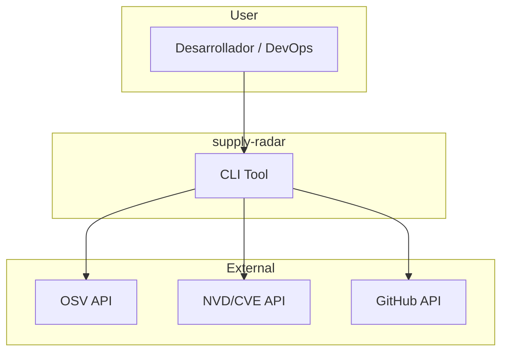
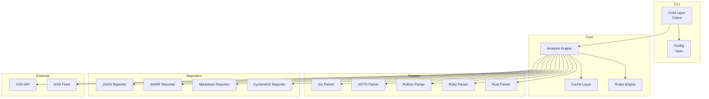
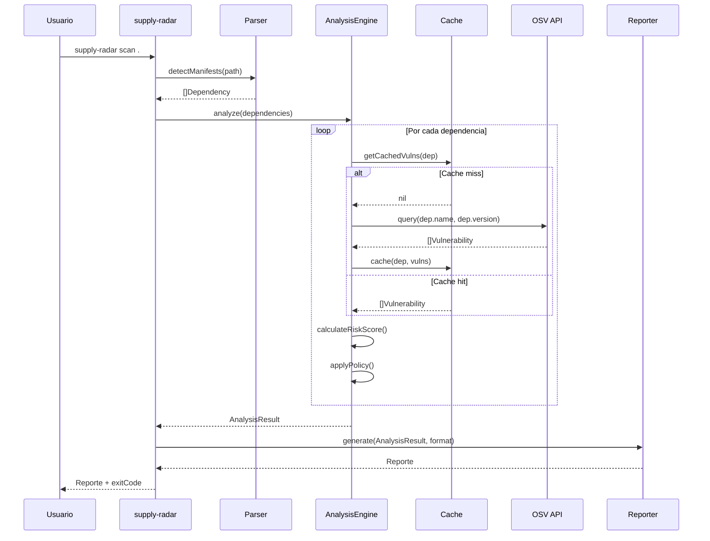
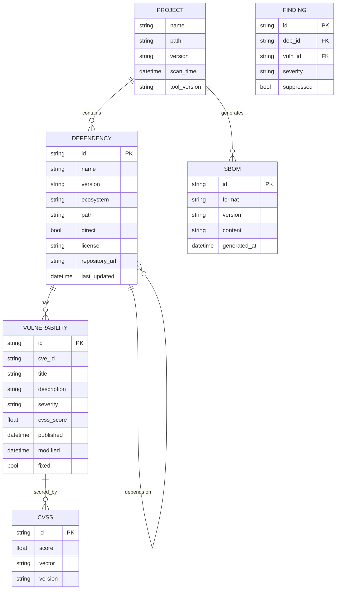

# supply-radar — Arquitectura

## Vision de Arquitectura

supply-radar sigue un diseno **modular de plugins** con tres capas principales:

1. **Entrada:** Parsers de manifiesto por ecosistema
2. **Procesamiento:** Motor de analisis, consulta a APIs de vulnerabilidades, scoring
3. **Salida:** Generadores de reporte multi-formato

## Diagrama de Contexto (C4 Level 1)



## Diagrama de Componentes (C4 Level 2)



## Diagrama de Flujo de Analisis



## Diagrama de Modelo de Datos



## Paquetes del Dominio

```
internal/
  analyzer/       Motor de analisis principal
  cache/          Cache local de vulnerabilidades
  config/         Configuracion y settings
  dependency/     Entidades y repositorios de dependencias
  parser/         Interfaces y registros de parsers
  reporter/       Interfaces y registros de reporters
  rules/          Reglas de politicas de riesgo
  scanner/        Orquestador del flujo de escaneo
  vulnerability/  Consultas a APIs de vulnerabilidades
```

## Proveedores de Parser

| Ecosistema | Manifiesto                     | Archivo Lock              | Complejidad |
| ----------------- | -------------------------------- | -------------------------- | --------------- |
| Go                | go.mod                              | go.sum                          | Baja          |
| Node.js           | package.json                        | package-lock.json / yarn.lock / pnpm-lock.yaml | Media         |
| Python            | pyproject.toml / setup.py           | poetry.lock / Pipfile.lock / requirements.txt | Media         |
| Ruby              | Gemfile                             | Gemfile.lock                    | Baja          |
| Rust              | Cargo.toml                          | Cargo.lock                      | Baja          |
| Java              | pom.xml / build.gradle              | gradle.lockfile                 | Media         |
| .NET              | .csproj / .fsproj                   | packages.lock.json              | Media         |

## Cache y Almacenamiento

- **Cache local:** SQLite para persistencia de resultados de escaneos previos
- **Cache de vulnerabilidades:** TTL de 24 horas por defecto (configurable)
- **Tamanio estimado:** ~100 MB para 10k dependencias con historial completo

## Roadmap Tecnico

### Fase ке (MVP)
- Parser Go (go.mod + go.sum)
- Parser Node.js (package.json + package-lock.json)
- Consulta a OSV API
- Reporte JSON + Tabla
- Configuracion basica

### Fase 2 (V1.1)
- Parsers Python, Ruby
- Cache SQLite con TTL
- Reporte SARIF
- Umbral de severidad
- Configuracion por archivo (.supply-radar.yaml)

### Fase 3 (V1.2)
- Parsers Rust, Java, .NET
- Generacion SBOM CycloneDX
- Modo offline completo
- Excepciones/suppressions
- Plugin system basico

### Fase 4 (V2.0)
- Reporte ejecutivo con dashboards
- Integracion GitHub Actions / GitLab CI
- Soporte multi-lenguaje en un solo scan
- CLI interactiva (TUI)
