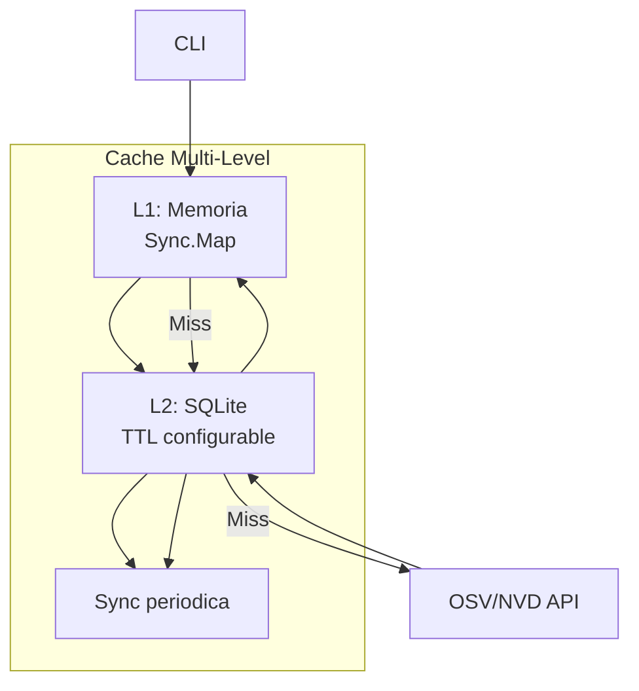

# supply-radar — Diseno Tecnico

## Convenciones de Codigo

- Codigo 100% en Go 1.23+
- Error handling explicito (no panic excepto init)
- Interfaces para cada abstraccion (parsers, reporters, cache)
- Documentacion godoc obligatoria para APIs publicas
- Tests en paralelo donde sea posible

## Diseno de Interfaces Principales

### Parser Interface

```go
package parser

type Parser interface {
    // Name returns the parser identifier (e.g., "go-mod")
    Name() string
    // Detect checks if the given path contains a manifest for this ecosystem
    Detect(path string) (bool, string)
    // Parse extracts dependencies from the manifest and lock files
    Parse(path string) ([]Dependency, error)
    // Supported returns list of file names this parser handles
    Supported() []string
}
```

### Reporter Interface

```go
package reporter

type Reporter interface {
    // Name returns the reporter identifier (e.g., "json", "table")
    Name() string
    // Format returns the MIME type of the output
    Format() string
    // Generate creates the report from the analysis result
    Generate(result AnalysisResult, w io.Writer) error
    // Supports returns true if this reporter can handle the given format
    Supports(format string) bool
}
```

### Cache Interface

```go
package cache

type Cache interface {
    Get(key string) ([]Vulnerability, bool)
    Set(key string, vulns []Vulnerability, ttl time.Duration)
    Clear() error
    Close() error
}
```

### Vulnerability Provider Interface

```go
package vulnerability

type Provider interface {
    // Query returns vulnerabilities for a specific package version
    Query(pkg Package) ([]Vulnerability, error)
    // Name identifies the provider (e.g., "osv", "nvd")
    Name() string
    // Healthy checks if the provider is available
    Healthy() bool
}
```

## Diseno de Tipos de Datos

```go
package dependency

// Dependency represents a single software dependency
type Dependency struct {
    ID          string
    Name        string
    Version     string
    Ecosystem   string // go, npm, pypi, etc.
    Path        string // file path in the project
    Direct      bool
    License     string
    Repository  string
    UpdatedAt   time.Time
}

// Vulnerability represents a known CVE or advisory
type Vulnerability struct {
    ID          string
    CVE         string
    Title       string
    Description string
    Severity    string // CRITICAL, HIGH, MEDIUM, LOW
    CVSS        float64
    PublishedAt time.Time
    ModifiedAt  time.Time
    FixedIn     string
    References  []string
}

// AnalysisResult is the output of scanning a project
type AnalysisResult struct {
    Project        Project
    Dependencies   []Dependency
    Vulnerabilities map[string][]Vulnerability // dep id -> vulns
    RiskScore      float64
    Timestamp      time.Time
    Duration       time.Duration
}

// Project represents the scanned project
type Project struct {
    Name    string
    Path    string
    Version string
}
```

## Flujo de Datos del Analisis

```mermaid
graph LR
    A[Archivos de proyecto] --> B[Detectores de manifiesto]
    B --> C[Parser especifico]
    C --> D[Lista de dependencias normalizada]
    D --> E[Deduplicacion y resolucion de versiones]
    E --> F[Consulta a proveedores de vulnerabilidades]
    F --> G[Scoring de riesgo por dependencia]
    G --> H[Evaluacion de politicas]
    H --> I[Generacion de reporte]
```



## Estrategia de Caching



- **L1 (Memoria):** Cache hot en memoria via `sync.Map` (no persistente)
- **L2 (SQLite):** Cache duradero con TTL por entrada. Tabla: `vulns(id, key, data, expires)`
- **L3 (Offline):** Snapshot JSON portable para modo offline completo

## Formato de Reportes

### Reporte Tabla (por defecto CLI)

```
+---------+---------+-------------------+
| PACKAGE | VERSION | VULNERABILITIES    |
+---------+---------+-------------------+
| lodash  | 4.17.19 | CVE-2021-23337    |
|         |         | HIGH (CVSS 7.4)   |
| express | 4.17.1  | None               |
+---------+---------+-------------------+
```

### Reporte JSON (machine-readable)

```json
{
  "metadata": {
    "project": "my-app",
    "version": "1.0.0",
    "timestamp": "2025-01-15T10:00:00Z",
    "duration_ms": 4823
  },
  "summary": {
    "dependencies": 47,
    "vulnerable": 3,
    "critical": 0,
    "high": 2,
    "medium": 1
  },
  "vulnerabilities": [...],
  "dependencies": [...]
}
```

### Reporte Markdown (ejecutivo)

- Resumen de riesgo agregado
- Tabla de vulnerabilidades criticas/alta
- Recomendaciones de remediation
- Firma del scan y hash de verificacion

## Estrategia de Testing

| Nivel            | Herramienta     | Cobertura objetivo |
|------------------|--------------------|----------------------|
| Unit tests       | Test + testify     | 80% core, 60% CLI    |
| Integration tests| Docker compose     | Flujo completo       |
| Benchmarks       | Go benchmark       | Parsing, queries     |
| CI               | GitHub Actions     | Linux/macOS/Windows  |

## Decisiones de Diseno Clave

| Decision                                  | Alternativa rechazada      | Justificacion                                                         |
| ------------------------------------------------- | -------------------------------- | --------------------------------------------------------------- |
| CLI vs Servicio                               | API REST                         | CLI autonomo facilita adopcion y CI/CD                              |
| Go vs Rust                                      | Rust                             | Go tiene mejor ecosistema de parsers y tooling                    |
| OSV API vs Scrapear NVD                       | NVD local                        | OSV API es mas estable y no requiere descomprimir gigabytes       |
| SQLite vs Redis                               | Redis                            | Zero-config para usuarios finales                               |
| Interface de plugins vs Monolito comprensivo  | Monolito                         | Plugins permiten contribuciones comunitarias mas faciles            |
| Reporte por streams vs todo en memoria        | Todo en memoria                  | Streaming soporta proyectos enormes sin OOM                       |
| Single-binary vs multi-binary                | Multi-binary                    | Distribucion sencilla, un solo `supply-radar`                    |
